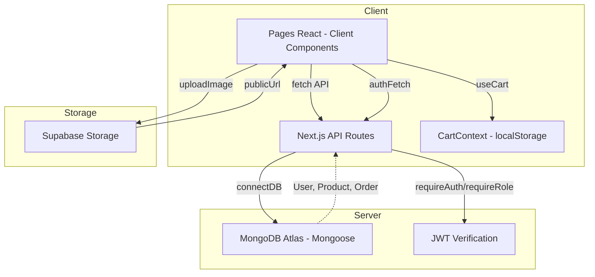

# Architecture du projet Mabex Store

## Structure des dossiers

```
mabex-store/
├── app/                          # Next.js App Router (pages + API)
│   ├── layout.tsx                # Root layout (CartProvider + Header + Footer)
│   ├── page.tsx                  # Homepage — catalogue produits (client component)
│   ├── globals.css               # Design tokens (oklch, thème jaune/blanc)
│   ├── loading.tsx               # Loading fallback global
│   │
│   ├── api/                      # 18 API Routes (Next.js Route Handlers)
│   │   ├── auth/                 # login, logout, me, register
│   │   ├── products/             # GET all, GET by id
│   │   ├── orders/               # POST create, GET user orders, GET/PATCH by id
│   │   ├── admin/                # stats, users CRUD, products CRUD, orders
│   │   └── seller/               # stats, products CRUD, orders
│   │
│   ├── admin/                    # Panel admin (21 pages au total)
│   │   ├── page.tsx              # Dashboard admin (stats globales)
│   │   ├── users/                # Lister, créer, détails, éditer utilisateurs
│   │   ├── products/             # Lister, gérer produits
│   │   └── orders/               # Lister, gérer commandes
│   │
│   ├── seller/                   # Dashboard vendeur
│   │   ├── page.tsx              # Dashboard vendeur (stats vendeur)
│   │   ├── products/             # CRUD produits vendeur (new, edit)
│   │   └── orders/               # Commandes du vendeur
│   │
│   ├── cart/                     # Page panier
│   ├── checkout/                 # Page checkout (auth inline + livraison)
│   ├── login/                    # Page de connexion
│   ├── register/                 # Page d'inscription
│   ├── orders/                   # Suivi commandes client
│   ├── order-confirmation/       # Confirmation de commande
│   └── products/[id]/            # Détail produit
│
├── components/                   # Composants React
│   ├── ui/                       # 50 composants shadcn/ui (button, card, dialog, etc.)
│   ├── admin/                    # Composants spécifiques admin
│   ├── seller/                   # Composants spécifiques vendeur
│   ├── header.tsx                # Navigation responsive + rôle-based menu
│   ├── footer.tsx                # Pied de page
│   ├── product-card.tsx          # Carte produit
│   ├── product-grid.tsx          # Grille de produits
│   ├── cart-button.tsx           # Bouton panier
│   ├── cart-item.tsx             # Item dans le panier
│   ├── price-calculator.tsx      # Calculateur de prix dégressif
│   ├── order-status-badge.tsx    # Badge statut commande
│   ├── order-timeline.tsx        # Timeline de commande
│   └── theme-provider.tsx        # Provider de thème
│
├── lib/                          # Logique métier et utilitaires
│   ├── auth.ts                   # JWT login/logout/register, requireAuth, requireRole, authFetch
│   ├── models.ts                 # 3 modèles Mongoose (User, Product, Order)
│   ├── types.ts                  # Interfaces TypeScript (User, Product, Order, Cart, etc.)
│   ├── mongodb.ts                # Connexion MongoDB Atlas (avec cache global)
│   ├── supabase.ts               # Upload/delete images Supabase Storage
│   ├── cart-context.tsx           # React Context + useReducer pour le panier
│   ├── mock-data.ts              # Données mockées (legacy, encore importé par certains fichiers)
│   └── utils.ts                  # Utilitaire cn() (clsx + tailwind-merge)
│
├── hooks/                        # Custom hooks
│   ├── use-mobile.ts             # Détection viewport mobile
│   └── use-toast.ts              # Hook toast notifications
│
├── scripts/
│   └── seed.ts                   # Script de seed MongoDB (tsx)
│
├── public/                       # Assets statiques (images produits PNG)
├── styles/                       # Dossier styles (peut être vide)
└── Configuration
    ├── package.json              # Dépendances et scripts
    ├── tsconfig.json             # Config TypeScript (paths @/ -> ./)
    ├── next.config.mjs           # Config Next.js (eslint/ts ignore, images unoptimized)
    ├── postcss.config.mjs        # PostCSS avec @tailwindcss/postcss
    ├── components.json           # Config shadcn/ui
    └── .env                      # Variables Supabase (NEXT_PUBLIC_SUPABASE_URL/ANON_KEY)
```

## Flux de données



## Authentification

1. **Login** : `POST /api/auth/login` → vérifie email/password avec bcrypt → génère JWT (7 jours)
2. **Token** : stocké dans `localStorage` sous clé `authToken`
3. **User data** : stocké dans `localStorage` sous clé `user` (JSON)
4. **Vérification** : `authFetch()` ajoute `Authorization: Bearer <token>` automatiquement
5. **Server-side** : `requireAuth(token)` décode le JWT et charge l'utilisateur depuis MongoDB
6. **RBAC** : `requireRole(token, ['admin'])` vérifie le rôle après authentification
7. **Logout** : suppression du token côté client (`localStorage.removeItem`)

> **⚠️ Point d'attention** : L'auth repose entièrement sur localStorage (pas de cookies httpOnly). La connexion MongoDB est hardcodée dans `lib/mongodb.ts` plutôt que via .env.

## Modèles de données (Mongoose)

### User
- `email` (unique, lowercase), `password` (bcrypt hash), `firstName`, `lastName`
- `role`: `customer` | `seller` | `admin`
- `phone?`, `address?`, `isActive`, timestamps

### Product
- `name`, `description`, `category`, `stock`
- `priceTiers[]`: `{ minQuantity, maxQuantity?, price }`
- `images[]` (URLs Supabase), `sellerId`, `isActive`, timestamps

### Order
- `userId`, `items[]`: `{ productId, productName, quantity, price, variant? }`
- `totalAmount`, `status`: `pending` → `confirmed` → `preparing` → `shipped` → `delivered` | `cancelled`
- `shippingAddress`, `phone`, `notes?`, timestamps
